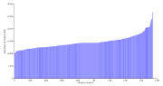

Daniel learned to program at his mother’s knee, and has been coding
off and on since, usually while he should be doing something else.  He
began teaching by showing adults how to double-click on a Mac.  In
school he learned to draw straight lines and talk about art.  More
recently he’s been using sensors, Python, and graphs to understand the
physics and energy use of buildings.  He’s interested in open hardware
beyond microelectronics and 3D printers, and in Free software for
design.  He can be reached at bergey@teallabs.org

## [Resume (pdf)](/docs/Daniel-Bergey-resume.pdf)

## Portfolio

### PA School District Expenditures - Interactive Web Graphs (2014)

\
My
[school districts project](http://bergey.github.io/school-districts/)
graphs data from the PA Department of Education on per-student
expenditures for each district in the state.  I wanted to understand
how the Philadelphia school budget compares to the rest of the state.
I like interactive web graphs because they are easy to share, and
allow some middle ground between the exploratory and explanatory
tendencies in data visualization.  The project is implemented in
Javascript using [D3](http://d3js.org/), and is available
[on github](https://github.com/bergey/school-districts).

### Finger-Jointed Box - Laser Cut from Parametric Design in Haskell (2013)

\
I laser cut the box at left from 1/16″ plywood, according to a
parametric design modeled in
[Diagrams](http://projects.haskell.org/diagrams/).  The design is
easily modified to arbitrary box dimensions and joint sizes.  I also
help maintain the [Diagrams](http://projects.haskell.org/diagrams/)
library for 2D & 3D graphics in
[Haskell](https://www.haskell.org/haskellwiki/Haskell).  

### Berrybasket - Networked Datalogger (2013)

Berrybasket measures up to 14 analog voltage sensors, and uploads the
data to a server, so that it can be viewed in near-realtime.  We wrote
the software, and designed a circuit board to connect the sensors to a
small and inexpensive Linux computer.  The project grew out of my
field monitoring of buildings, where it is inconvenient to frequently
visit to collect data, but where a system failure between visits can
result in months of missed data.  We used the board in Philadelphia
classroom in 2013.

The hardware and software are described on
[http://bergey.github.io/berrybasket/](http://bergey.github.io/berrybasket/),
along with links to the source code and PCB design.  I also
[wrote a bit more about the process here](posts/2014-05-19-my-first-pcb.html)

## Publications
* Daniel Bergey and Christalee Bieber. “Teaching with Open Boxes: Datalogging in the Classroom, *Open Hardware Summit* (2013). [(project website)](http://bergey.github.io/berrybasket)

* Armin Rudd and Daniel Bergey.  *Ventilation System Effectiveness and Tested Indoor Air Quality Impacts.* Building Science Corporation, 2013.  [pdf](http://www.buildingscience.com/documents/bareports/ba-1309-ventilation-system-effectiveness-and-indoor-air-quality-impacts/)

* A. Rudd, H. Henderson, D. Bergey, D. Shirey. *RP-1449: Energy Efficient and Cost Assessment of Humidity Control Options for Residential Buildings.* ASHRAE, 2012.  [(PDF behind paywall)](http://www.techstreet.com/products/1856921/product_items/4874670href)

* Daniel Bergey and Kohta Ueno. “New England Net Zero Production Houses,” *ASHRAE Transactions* 117(2) (2011). [(pdf)](http://www.buildingscience.com/documents/confpapers/cp-1103-new-england-net-zero-production-houses/view)
