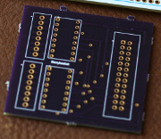

Daniel learned to program at his mother’s knee, and has been coding
off and on since, usually while he should be doing something else.  He
began teaching by showing adults how to double-click on a Mac.  In
school he learned to draw straight lines and talk about art.  More
recently he’s been using sensors, Python, and graphs to understand the
physics and energy use of buildings.  He’s interested in open hardware
beyond microelectronics and 3D printers, and in Free software for
design.  He can be reached at bergey@teallabs.org

## Portfolio

### PA School District Expenditures - Interactive Web Graphs (2014)

\
My
[school districts project](http://bergey.github.io/school-districts/)
graphs data from the PA Department of Education on per-student
expenditures for each district in the state.  I wanted to understand
how the Philadelphia school budget compares to the rest of the state.
I like interactive web graphs because they are easy to share, and
allow some middle ground between the exploratory and explanatory
tendencies in data visualization.  The project is implemented in
Javascript using [D3](http://d3js.org/), and is available
[on github](https://github.com/bergey/school-districts).

### Pandoc RST Reader (2014)

I improved [pandoc's](http://pandoc.org) support for
[RST](http://docutils.sourceforge.net/rst.html), including adding
support for
[class directives](https://github.com/jgm/pandoc/pull/1781), warnings
about unknown syntax, and improved
[custom roles](https://github.com/jgm/pandoc/pull/1805).  Class
directives are converted to HTML as a div tag with the specified
class(es).  Custom roles are similar, for inline elements instead of
block; in other words, they become span tags in HTML.  I'm mostly
interested in both features as a way to mark particular document
elements for special processing by filters (like `diagrams-pandoc`,
below).  There are more details in the
[release notes](http://pandoc.org/releases.html#pandoc-1.13.2-20-dec-2014).

### `diagrams-pandoc` - Pandoc Filter for Vector Graphics Language (2014)

I wrote the initial version of
[diagrams-pandoc](https://github.com/diagrams/diagrams-pandoc), a
filter to convert Haskell code in markdown or other pandoc-readable
formats into images in the final output.  `diagrams-pandoc` is now
collectively maintained by the Diagrams team.  I hope that this filter
will make it easier for people to include Diagrams in their documents,
especially when writing for the web, and also encourage more people to
use Diagrams.

### Finger-Jointed Box - Laser Cut from Parametric Design in Haskell (2013)

\
I laser cut the box at left from 1/16″ plywood, according to a
parametric design modeled in
[Diagrams](http://projects.haskell.org/diagrams/).  The design is
easily modified to arbitrary box dimensions and joint sizes.  I also
help maintain the [Diagrams](http://projects.haskell.org/diagrams/)
library for 2D & 3D graphics in
[Haskell](https://www.haskell.org/haskellwiki/Haskell).  

### Metafont in Haskell - Spline Interpolation in Diagrams (2013)

https://github.com/diagrams/diagrams-contrib/pull/16

### Berrybasket - Networked Datalogger (2013)

Berrybasket measures up to 14 analog voltage sensors, and uploads the
data to a server, so that it can be viewed in near-realtime.  The
project grew out of my field monitoring of buildings, where it is
inconvenient to frequently visit to collect data, but where a system
failure between visits can result in months of missed data.  We used
the board in Philadelphia classroom, and presented a poster about it
at the *Open Hardware Summit* in 2013.

The hardware and software are described on
[the project website](http://bergey.github.io/berrybasket/),
along with links to the source code and PCB design.  I also
[wrote a bit more about the process here](posts/2014-05-19-my-first-pcb.html).

## [Resume (pdf)](/docs/Daniel-Bergey-resume.pdf)

## Publications
* Armin Rudd and Daniel Bergey.  *Ventilation System Effectiveness and Tested Indoor Air Quality Impacts.* Building Science Corporation, 2013.  [pdf](http://www.buildingscience.com/documents/bareports/ba-1309-ventilation-system-effectiveness-and-indoor-air-quality-impacts/)

* A. Rudd, H. Henderson, D. Bergey, D. Shirey. *RP-1449: Energy Efficient and Cost Assessment of Humidity Control Options for Residential Buildings.* ASHRAE, 2012.  [(PDF behind paywall)](http://www.techstreet.com/products/1856921/product_items/4874670href)

* Daniel Bergey and Kohta Ueno. “New England Net Zero Production Houses,” *ASHRAE Transactions* 117(2) (2011). [(pdf)](http://www.buildingscience.com/documents/confpapers/cp-1103-new-england-net-zero-production-houses/view)
